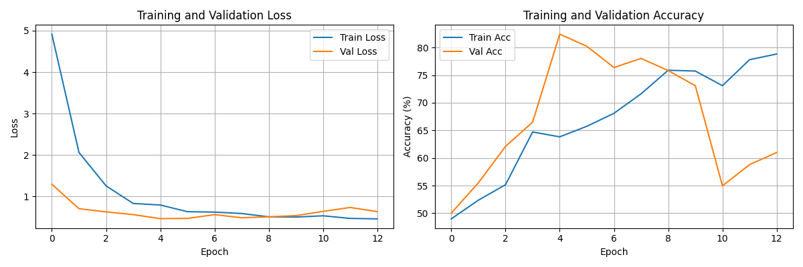
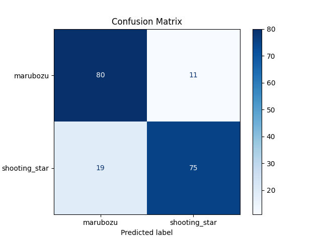

# Candlestick Pattern Classification using CNN + Backtesting

## 1. Overview
This project applies a Convolutional Neural Network (CNN) to classify candlestick patterns from stock chart images. It integrates a complete pipeline from data acquisition and image generation to model training and backtesting, evaluating the predictive power of technical patterns in a quantitative trading context.

## 2. Problem Statement
The goal is to automate the detection of specific candlestick patterns (Marubozu and Shooting Star) directly from OHLC (Open, High, Low, Close) data converted into images. Furthermore, the project assesses whether these classical patterns, when identified by a CNN, provide a profitable signal for short-term trading.

## 3. Dataset
*   **Source:** Historical stock data downloaded via Yahoo Finance (`yfinance`).
*   **Preprocessing:** OHLC data converted to candlestick chart images.
*   **Generation:** Uses a sliding window of 20 candles per image.
*   **Labeling:** Rule-based logic used to ground-truth samples.
*   **Classes:**
    *   `Marubozu` (Strong trend)
    *   `Shooting Star` (Bearish reversal)

## 4. Methodology
1.  **Data Ingestion:** Fetch daily stock data for a diverse set of tickers.
2.  **Image Synthesis:** Generate 224x224 candlestick charts without axes/volume to focus solely on price action.
3.  **Model Architecture:** Train a custom CNN from scratch (no pretrained weights) to classify the images.
4.  **Evaluation:** Test on a held-out dataset and validate performance using accuracy metrics and confusion matrices.

## 5. Model Performance
*   **Test Accuracy:** ~82%
*   **Confusion Matrix:** See `confusion_matrix.png` for detailed class-wise performance.

## 6. Backtesting Strategy
*   **Entry Signal:** Buy at the next day's Open price if a pattern is detected with high confidence.
*   **Exit Signal:** Sell at the Close price after 3 trading days.
*   **Constraint:** Sequential trades only (no overlapping positions).
*   **Transaction Costs:** 0.1% per trade applied to simulate real-world friction.

## 7. Backtesting Results
*   **CAGR:** ~22%
*   **Total Return:** ~22%
*   **Win Rate:** ~51%
*   **Max Drawdown:** ~28%
*   **Total Trades:** 57

## 8. Key Insights
*   **Pattern Efficacy:** The *Shooting Star* pattern demonstrated positive expected returns in the test period.
*   **False Signals:** The *Marubozu* pattern, while detected accurately, was not profitable in this specific strategy.
*   **General Finding:** Classical technical patterns do not guarantee predictive value; their utility varies significantly by market regime and timeframe.

## 9. Limitations
*   **Dataset Size:** Limited number of samples compared to large-scale deep learning datasets.
*   **Labeling Bias:** Ground truth relies on fixed heuristic rules, which the model attempts to approximate.
*   **Scope:** Single timeframe (Daily) and limited asset universe.
*   **Risk Management:** Strategy lacks position sizing or dynamic stop-loss mechanisms.

## 10. Future Work
*   Expand dataset to include hundreds of tickers and multiple timeframes.
*   Incorporate additional patterns (e.g., Engulfing, Morning Star).
*   Implement portfolio allocation and risk management layers.
*   Experiment with advanced architectures (ResNet, LSTM-CNN).

## 11. How to Run

### Install Dependencies
```bash
pip install -r requirements.txt
```

### 1. Generate Dataset
Download data and create images:
```bash
python src/generate_dataset.py
```

### 2. Train Model
Train the CNN and save the model:
```bash
python src/train_cnn.py
```

### 3. Run Backtest
Evaluate the strategy:
```bash
python src/backtest.py
```

This project teaches a computer to recognize candlestick patterns in stock charts - just like how a trader would look at charts and identify patterns!

### The 2 Patterns We Detect:

1. **Marubozu** 🟩
   - A strong bullish candle with a very large body and little to no wicks.
   - Indicates strong buying pressure.
   - Opens at the low and closes at the high.

2. **Shooting Star** 🌠
   - A bearish reversal candle.
   - Has a small body at the bottom and a long upper wick.
   - Indicates buyers pushed price up, but sellers pushed it back down.

---

## 📁 Project Structure

```
candlestick-cnn/
│
├── data/
│   ├── raw/              # Downloaded stock CSV files
│   └── images/
│       ├── train/        # Training images
│       ├── val/          # Validation images
│       └── test/         # Test images
│           ├── marubozu/
│           └── shooting_star/
│
├── src/
│   ├── generate_dataset.py   # Step 1: Create the dataset
│   ├── train_cnn.py          # Step 2: Train the CNN
│   └── backtest.py           # Step 3: Test on real data
│
├── candlestick_cnn_model.pth # Saved model
├── training_history.png      # Training loss/accuracy plot
├── confusion_matrix.png      # Model performance matrix
├── requirements.txt          # Python dependencies
└── README.md                 # This file!
```

---

## 🚀 How to Run

### Step 0: Setup Environment

```bash
# Create a virtual environment (recommended)
python -m venv venv

# Activate it
# On Windows:
venv\Scripts\activate
# On Mac/Linux:
source venv/bin/activate

# Install dependencies
pip install -r requirements.txt
```

### Step 1: Generate the Dataset

```bash
python src/generate_dataset.py
```

This will:
- Download 5 years of stock data for 20 major stocks (AAPL, MSFT, etc.)
- Find Marubozu and Shooting Star patterns
- Create candlestick chart images (224x224 pixels)
- Split into train/val/test folders

### Step 2: Train the CNN

```bash
python src/train_cnn.py
```

This will:
- Load the images
- Train a CNN to classify the patterns
- Show training progress (loss and accuracy)
- Save the best model to `candlestick_cnn_model.pth`
- Generate performance plots (`training_history.png` and `confusion_matrix.png`)

### Step 3: Backtest the Model

```bash
python src/backtest.py
```

This will:
- Load the trained model
- Download new stock data
- Use the CNN to predict patterns
- Simulate trading based on predictions

---

## 🧠 How the CNN Works

### What is a CNN?

A **Convolutional Neural Network** is a type of neural network designed for images. It learns to recognize patterns by sliding filters across the image to detect features.

### CNN Architecture

```
Input: 224x224 RGB image
    ↓
[Conv2D: 64 filters] → BN → ReLU → MaxPool
    ↓
[Conv2D: 128 filters] → BN → ReLU → MaxPool
    ↓
[Conv2D: 256 filters] → BN → ReLU → MaxPool
    ↓
[Flatten]
    ↓
[Dense: 1024] → ReLU → Dropout
    ↓
[Dense: 512] → ReLU → Dropout
    ↓
[Dense: 2] → Output (Marubozu, Shooting Star)
```

---

## 📐 Pattern Detection Rules

### Marubozu
```
body = |close - open|
range = high - low

IS MARUBOZU if:
  - close > open (bullish)
  - upper_wick <= 0.05 × range
  - lower_wick <= 0.05 × range
  - body >= 0.9 × range
```

### Shooting Star
```
body = |close - open|
range = high - low
upper_wick = high - max(open, close)
lower_wick = min(open, close) - low

IS SHOOTING STAR if:
  - body <= 0.3 × range
  - upper_wick >= 2 × body
  - lower_wick <= 0.25 × body
```

---

## 📊 Results

Here are the results from training the model:

### Training History
The graph below shows the loss and accuracy over epochs.


### Confusion Matrix
The matrix below shows how well the model classifies each pattern.


---

## 📈 Backtesting Strategy

The backtest uses a simple trading strategy:

1. **Entry**: When CNN detects a pattern with >50% confidence, buy at the next day's open
2. **Exit**: Sell at close after 3 trading days
3. **Metrics**: Calculate win rate, total return, average return per trade

### ⚠️ Important Disclaimer

This is an **educational project only**! Real trading requires:
- Transaction costs (commissions, fees)
- Slippage (price movement when executing)
- Risk management (position sizing, stop losses)
- More sophisticated strategies
- Proper testing and validation

**Never trade real money based on this simple model!**

---

## 📊 Expected Results

Results will vary, but typical outcomes:

- **Training Accuracy**: 70-90%
- **Validation Accuracy**: 60-80%
- **Win Rate in Backtest**: 45-60%

If your accuracy is very low:
- Check if you have enough images in each class
- Try training for more epochs
- Make sure images are generated correctly

---

## 🔧 Customization Ideas

Once you understand the basics, try these:

1. **Add more patterns**: Doji, Hammer, Evening Star, Three White Soldiers
2. **Use different window sizes**: 10 candles, 30 candles
3. **Try transfer learning**: Use a pretrained model like ResNet
4. **Improve the trading strategy**: Add stop-losses, different hold periods
5. **Add more features**: Volume, moving averages
6. **Try different stocks**: Crypto, Forex, Futures

---

## 🐛 Troubleshooting

### "No module named 'torch'"
```bash
pip install torch torchvision
```

### "No data downloaded from yfinance"
- Check your internet connection
- Some tickers might not have data
- Try different date ranges

### "Not enough images generated"
- The patterns are relatively rare
- Try adding more stock tickers
- Use a longer date range (more years)

### "Low accuracy"
- Ensure balanced classes (similar number of images per pattern)
- Try training for more epochs
- Check if images look correct

---

## 👤 Author
Created as an educational project for learning ML/DL in finance.

For queries and suggestions please feel free to reach out:
Mohakk Harshal Malvankar | mohakkmalvankar1104@gmail.com

---

## 📝 License

MIT License - Feel free to use, modify, and share!

---

**Happy Learning! 🎓**

If you found this helpful, consider starring the repo ⭐
